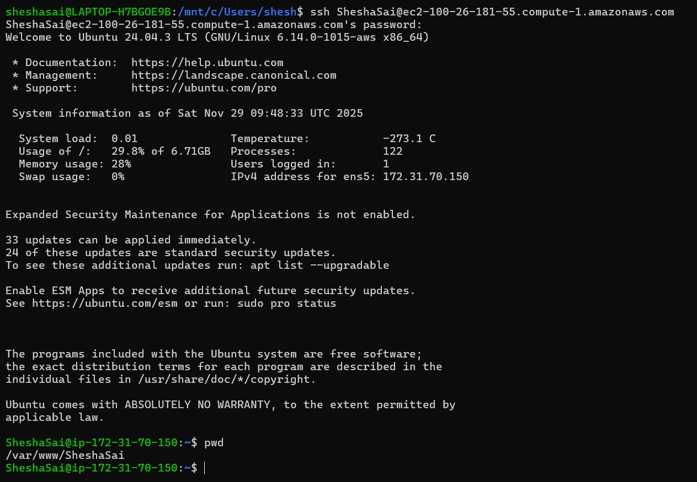

#  EC2 Apache Multi-Tenant-Hosting Automation

------------------------------------------------------------------------

## 📖 Project Overview

This project automates onboarding and offboarding for students who need
simple personal **static web hosting** on a shared EC2 server.

Using Bash scripts and Apache, the suite performs the following
automatically:

-   Creates a Linux user and home directory.
-   Generates a minimal website (`index.html`) for the student.
-   Configures an Apache VirtualHost that exposes the site on a
    dedicated port.
-   Updates Apache to listen on the assigned port.
-   Tracks actions in audit logs.
-   Removes all artifacts on offboarding and frees the port for reuse.

The focus is on clear, auditable, and repeatable steps suitable for
classroom use.


                      Project Architecture

------------------------------------------------------------------------

## 📑 Table of Contents

-   [Network Architecture (AWS)](#1-network-architecture-aws)
-   [Prerequisites](#2-prerequisites)
-   [The Automation Suite](#3-the-automation-suite)
-   [Example: Small Classroom
    Walkthrough](#4-example-small-classroom-walkthrough)
-   [Under the Hood: Apache Config](#5-under-the-hood-apache-config)
-   [Enabling Password Login](#6-enabling-password-login)
- [Student Guide: Accessing the Server](#7-student-guide-accessing-the-server)
- [Conclusion & Project Utility](#8-conclusion--project-utility)

------------------------------------------------------------------------

## 1. Network Architecture (AWS)

In AWS, configure the EC2 instance's Security Group (inbound rules) to
permit:

 | Type     | Port / Range | Who uses it          |
|----------|--------------|----------------------|
| SSH      | 22           | Admin only           |
| HTTP     | 80           | Public landing page  |
| Custom TCP | 8080–8090  | Student site ports   |


**Recommendation:** Choose a port range that matches class size. For 10+
students expand the Custom TCP range (e.g., `8070–8090`).

------------------------------------------------------------------------

## 2. Prerequisites

On a fresh Ubuntu EC2 instance:

### **Step 1: Update packages and install Apache**

``` bash
sudo apt update
sudo apt install -y apache2
```

### **Step 2: Verify Apache is active**

``` bash
sudo systemctl status apache2
```

------------------------------------------------------------------------

## 3. The Automation Suite

Place the scripts in a `scripts/` folder in your repository.

------------------------------------------------------------------------

### **3.1 Onboarding --- `User_Create.sh`**

**Purpose:** Create a Linux user, generate a basic website, configure
Apache on a custom port, and log the operation.

**Actions performed:**

-   **Input:** Prompts admin for username, password, and port.
-   **User Creation:** Creates system user with home directory
    `/var/www/<user>`.
-   **Web Content:** Creates a default `index.html`.
-   **Config:** Writes `/etc/apache2/sites-available/<user>.conf`.
-   **Ports:** Adds `Listen <PORT>` to `/etc/apache2/ports.conf` if
    missing.
-   **Activation:** Enables site and reloads Apache.
-   **Logging:** Records event to `/var/log/user_onboarding.log`.

------------------------------------------------------------------------

### **3.2 Offboarding --- `User_Delete.sh`**

**Purpose:** Remove the student user, their files, and Apache config,
and free the port.

**Actions performed:**

-   **Input:** Prompts admin for the username and port to remove.
-   **Cleanup:** Disables site, removes `.conf` file, and deletes the
    user/home directory.
-   **Port Management:** Removes the `Listen <PORT>` line from
    `ports.conf`.
-   **Logging:** Appends a `DELETED` status to the log file.

------------------------------------------------------------------------

## 4. Example: Small Classroom Walkthrough

### **Scenario:** Onboard student SheshaSai on port `8081`.

#### **1. Run the Create Script:**

``` bash
sudo ./scripts/User_Create.sh
```

#### **2. Enter Details When Prompted:**

    Enter new username: SheshaSai
    Enter password: [hidden]
    Enter the Port number: 8081

#### **3. Verify:**

Open your browser:

👉 `http://<EC2_PUBLIC_IP>:8081`

You should see:
**"Welcome to SheshaSai's page"**

#### **4. Offboard SheshaSai (End of Course):**

``` bash
sudo ./scripts/User_Delete.sh
```

When asked, enter:

    SheshaSai  
    8081  

------------------------------------------------------------------------

## 5. Under the Hood: Apache Config

Here is the VirtualHost template automatically generated by the
onboarding script:

    <VirtualHost *:<PORT>>
        DocumentRoot /var/www/<user>
        <Directory /var/www/<user>>
            Options Indexes FollowSymLinks
            AllowOverride All
            Require all granted
        </Directory>
    </VirtualHost>

------------------------------------------------------------------------

## 6. Enabling Password Login

By default, many EC2 images prefer keypair logins. For classroom
convenience, you may temporarily enable password authentication.

### Edit SSH config:

``` bash
sudo nano /etc/ssh/sshd_config.d/60-cloudimg-settings.conf
# or /etc/ssh/sshd_config on older images
```

### Set:

    PasswordAuthentication yes

### Restart SSH:

``` bash
sudo systemctl restart ssh
```

------------------------------------------------------------------------

## 7. Student Guide: Accessing the Server

Once the administrator has run the User_Create.sh script, the student can log in immediately to start editing their website.

#### **Step 1: Open Terminal (Mac/Linux) or PowerShell (Windows)**

#### **Step 2: Connect via SSH**
Students will connect using the username created by the script:
```bash
ssh <student_username>@<EC2_PUBLIC_IP>
```

#### **Step 3: Enter Password**
Enter the password assigned by the instructor.

#### **Step 4: Edit the Website**
Upon login, the student lands directly in their web directory (/var/www/<username>). They can immediately edit their live site:
```bash
nano index.html
```

Eample SSH for Student named SheshaSai

## 8. Conclusion & Project Utility

### **The Problem: Efficiency vs. Administration**
In an educational setting, provisioning a dedicated server for every student is financially wasteful. However, manually creating users and configuring ports on a shared server is slow and prone to human error.

### **The Solution: Automated Multi-Tenancy**
This project solves that friction by implementing **Single-Instance Multi-Tenancy**. By treating the EC2 instance as a shared resource pool, we achieve:

1.  **High-Density Hosting:** We can host multiple student websites on a single, low-cost instance (like a t2.micro) by leveraging Apache's efficiency, rather than paying for idle resources on separate servers.
2.  **Resource Isolation:** Leveraging Linux user permissions and Apache VirtualHosts ensures one student cannot modify another student's files.
3.  **Operational Efficiency:** Reducing the onboarding time from 15 minutes (manual) to 5 seconds (scripted).

### **Core Competencies Demonstrated**
This architecture highlights key Cloud Engineering skills:
* **Resource Optimization:** Maximizing the utility of cloud infrastructure to reduce costs.
* **System Security:** Implementing "Least Privilege" access using Linux file permissions.
* **Automation:** Replacing manual workflows with consistent, auditable Bash scripting.
